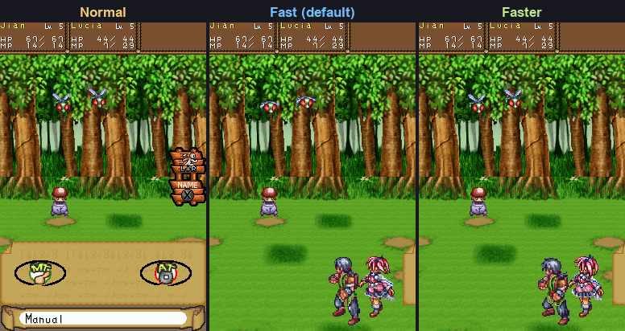
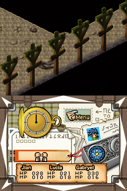
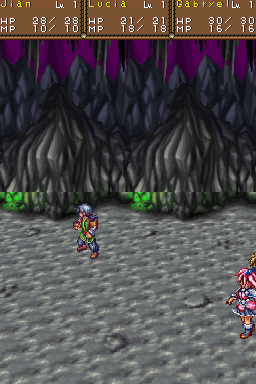
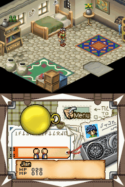
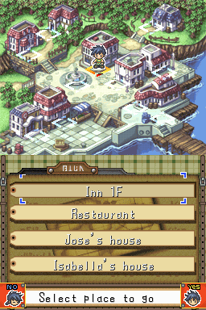

# Dragon Song: Definitive Edition

**A fan patch that fixes "the worst RPG ever made."** Running no longer costs HP, every battle gives experience,
items, and silver, you pick your own targets, battles are faster, spells cost less MP, and the microphone
is gone.

**[Download the latest patch](../../releases/latest)** (a `.bps` file; you need your own USA ROM, see
[How to play it](#how-to-play-it)).

<p align="center">
  <br>
  <em>The same battle on each battle speed: Normal (the original timing), Fast (the default), and Faster.</em>
</p>

<table>
  <tr>
    <th width="33%">Running costs no HP</th>
    <th width="33%">Experience, silver, and items from every battle</th>
    <th width="33%">Select goes straight to Save, and exits the menu from any screen</th>
  </tr>
  <tr>
    <td></td>
    <td></td>
    <td></td>
  </tr>
  <tr>
    <th>Pick your own targets</th>
    <th>Navigate towns and the world map with the D-pad</th>
    <th></th>
  </tr>
  <tr>
    <td></td>
    <td></td>
    <td></td>
  </tr>
</table>

This is an early beta (v0.1.5). A lot of the systems work is done, and more is coming as playtesting turns up
what still drags, such as trimming the fluff from enemy attack animations. Work on the story has started too:
better character development, smoother rough edges, and no more retcons or contradictions with Lunar 1 and 2.
Feedback is welcome in [Issues](../../issues).

A ROM hack of Lunar: Dragon Song (Nintendo DS, USA) that fixes the game's systems so that playing it feels
like Lunar 1 and 2 (Silver Star Story Complete and Eternal Blue Complete). The battle system stays the game's
own; everything around it is reworked. The design decisions are in [docs/design.md](docs/design.md), and
the state of every change, with how it was tested, is in [docs/status.md](docs/status.md).

## What it changes

The short version. Every change is listed in **[CHANGES.md](CHANGES.md)**, along with the version history, and
how each one was built and tested is in [docs/status.md](docs/status.md).

**Exploring**

- Running costs no HP: a timed dash with a short cooldown, like Eternal Blue.
- Walking and running are 50% faster than vanilla, and ramps and stairs no longer slow you down.
- Enemies come back when you leave an area, not on a timer, and blue chests are unlocked once every monster in the area
  is beaten.
- Healing statues heal more quickly and cure status.
- Clearing an area no longer recovers hp/mp.
- Town and world map menus work with the D-pad.

**Menus and text**

- Select opens the Save screen, and Select anywhere in the menu goes straight back to the map.
- Much faster menus.
- Hold A to make text print 3x faster. Still stops at transitions for another A press.
- Hold B to make text print 3x faster and auto-advance.
- The Start guidebook explains this version's rules.

**Battles**

- One battle mode: experience, items, and silver from every fight, and bosses give experience.
- You pick your own targets, and an attack is never wasted. With only one enemy in reach, Fight attacks it
  right away.
- Switch between three battle speeds by pressing R: Fast (the default), Faster, and Normal. Party attacks and the gaps between them are
  quicker, and Auto switches to Faster.
- No microphone: hold L and R to run away.
- Benched characters gain the same exp as the party, including before you meet them.
- Gear and items that are broken or stolen during battle are returned after you win.

**Spells and MP**

- Spells cost about 40% of their old MP, and Lucia learns them one level at a time.
- MP items restore a flat amount, and Mental Gum is sold in shops.

**Gad's Express**

- Delivery jobs grow with your journey, with a better-paying "future" job.

**Story**

- Under way: better character development, smoothing off the rough edges, and removing the retcons and
  contradictions with Lunar 1 and 2. So far: a new opening narration, retranslated from the Japanese release,
  and a new wake-up scene.

## How to play it

You need your own copy of Lunar: Dragon Song (USA). Releases contain a patch, never the game.

1. Check your ROM: SHA-1 `e5ac472b2a5de04215e54ab098c94247a88e1c08`. Other dumps or other regions will not
   work.
2. Download the `.bps` patch from the [releases](../../releases) page.
3. Apply it with any BPS patcher, for example [Floating IPS](https://www.smwcentral.net/?p=section&a=details&id=11474)
   or the [ROM Patcher JS](https://www.marcrobledo.com/RomPatcher.js/) website, to get the patched `.nds`.
4. Play it in a DS emulator, or on a DSi or 3DS with TWiLight Menu++ (tested on a 3DS).

Start a **New Game** to see the new opening. Saves from the original game work, but a few changes (such as
the opening) only show in a new game.

## Credits and origin

This project started after watching i am a dot's video
[My Brief Obsession with the Worst RPG Ever Made](https://www.youtube.com/watch?v=g3ZHiycAYeQ) (2026),
whose closing list of fixes for Lunar: Dragon Song lines up closely with what this hack sets out to do.
Thanks for the reminder that this game deserved another look.

Lunar: Dragon Song was developed by Japan Art Media with Game Arts and published by Marvelous Interactive
(Japan), Ubisoft (North America), and Rising Star Games (Europe). This repository contains no game data;
you need your own copy of the game.

## Building it yourself

You need your own copy of the game. This repo never contains the ROM or anything extracted from it.

1. Put the USA ROM at `rom/Lunar - Dragon Song (USA).nds`.
   Expected SHA-1: `e5ac472b2a5de04215e54ab098c94247a88e1c08`.
2. Download `dsd-windows-x86_64.exe` from [ds-decomp v0.12.1](https://github.com/AetiasHax/ds-decomp/releases)
   to `tools/dsd.exe`.
3. Extract the ROM:

   ```
   tools/dsd.exe rom extract -r "rom/Lunar - Dragon Song (USA).nds" -o extract
   ```

4. Build the patched ROM (written to `build/dsde.nds`):

   ```
   uv run python -m dsde.patches
   ```

5. Make a release patch from it (checks that the patch rebuilds the same ROM):

   ```
   uv run python -m dsde.bps create "rom/Lunar - Dragon Song (USA).nds" build/dsde.nds build/dsde.bps
   ```

An unmodified rebuild (`tools/dsd.exe rom build -c extract/config.yaml -o build/rebuild.nds`) matches the
original byte for byte except the secure area checksum at header offset 0x6C and the header CRC at 0x15E,
which need an ARM7 BIOS (`-7`) to recompute. Emulators ignore them.

For real hardware, put your own DS ARM7 BIOS dump (16 KB, for example from a DSi with dumpTool) at
`tools/bios7.bin` before running `uv run python -m dsde.patches` (or pass `--arm7-bios <path>`). The build
then passes it to dsd, which writes the secure area checksum. Our patched ROMs need this because the new
ITCM code makes the arm9 autoload table at 0x02000B00, inside the secure area, differ from the original.
Without it the checksum stays 0 (dsd recomputes the header CRC either way).
Checked 2026-10-06: with a good dump (CRC32 1280F0D5) an unmodified rebuild is byte-identical to the
original ROM, secure area checksum 0x1413 included.

Hardware notes: nds-bootstrap (TWiLight Menu++ on a DSi or 3DS) only puts code in ITCM for a few DSiWare
titles and has no fix patch for this game (ALNE), so our ITCM cave at 0x01FF8300 does not collide with it.
The patched ROM runs on a 3DS with TWiLight Menu++.

## Layout of the game

- `extract/arm9/arm9.bin`: all of the game code (about 690 KB, uncompressed, no overlays).
- `extract/files/*.dat`: packed data archives. Likely contents from the names:
  `btldata` (battle and enemy data), `script` and `evedata` (story text and events), `mapdata` (maps),
  `shoppack` (shops), `facedata` (portraits), `sound_data.sdat` (music and sound).
