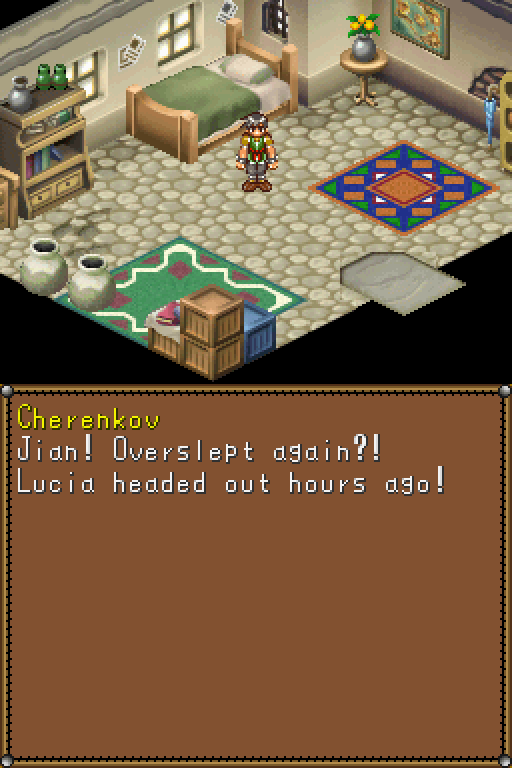
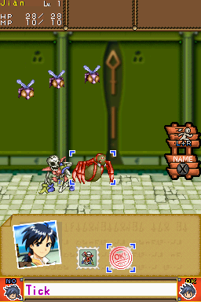
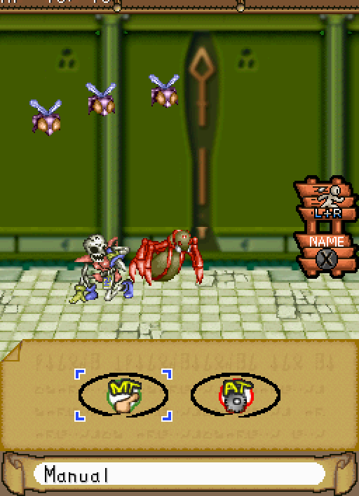
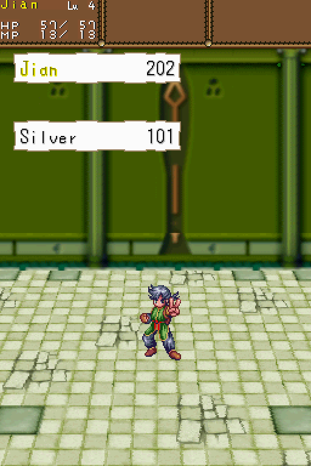

# Dragon Song: Definitive Edition

**A fan patch that fixes "the worst RPG ever made."** Running no longer costs HP, every battle gives EXP,
items and silver, you pick your own targets, battles are faster, spells cost less MP, and the microphone
is gone.

**[Download the latest patch](../../releases/latest)** (a `.bps` file; you need your own USA ROM, see
[How to play it](#how-to-play-it)).

<table>
  <tr>
    <th width="25%">New opening</th>
    <th width="25%">Pick your own targets</th>
    <th width="25%">Run with L+R, no microphone</th>
    <th width="25%">Silver from every battle</th>
  </tr>
  <tr>
    <td></td>
    <td></td>
    <td></td>
    <td></td>
  </tr>
</table>

This is an early beta (v0.1.2): the engine and battle changes are in, and the story rewrite has only just
started. Feedback is welcome in [Issues](../../issues).

A ROM hack of Lunar: Dragon Song (Nintendo DS, USA) that fixes the game's systems so that playing it feels
like Lunar 1 and 2 (Silver Star Story Complete and Eternal Blue Complete). The battle system stays the game's
own; everything around it is reworked. The design decisions are in [docs/design.md](docs/design.md), and
the state of every change, with how it was tested, is in [docs/status.md](docs/status.md).

## What it changes

### Exploring

- **Running costs no HP.** Hold B to dash for about 3 seconds, then it cools down for about 3 seconds, like
  the Eternal Blue dash. Holding B runs once; press it again to run again.
- **Walking is 50% faster and running is 3 times the original walking speed.** The run is ready again
  whenever you enter a new area.
- **Enemies come back when you leave an area and return**, not instantly. Blue chests unlock once every
  enemy in the area is beaten, at your own pace.
- **No HP and MP refill for clearing an area.** Healing statues fully restore HP and MP and now also cure
  status (poison and the like), with no camera pan:
  the sparkle and heal happen at once.
- **The save glitch is fixed.** Talking to Flora twice in the Underground Tunnel no longer locks out saving.

- **Town and world maps work with the D-pad.** In a "Select place to go" menu, Up and Down move through the
  places, Left and Right switch tabs, and A goes there. Touch works as before.

### Battles

- **One battle mode.** The Combat / Virtue switch is gone: every battle gives EXP, items and silver, and the
  Virtue clock is removed.
- **Battles drop silver**, based on the EXP the battle gives. The victory screen counts the silver up next to
  the EXP, and a second page lists the items received.
- **Bosses give EXP** (in the original they gave almost none): about ten regular enemies' worth from the
  area they are fought in.
- **You pick targets** on the touch screen or with the D-pad, as in Lunar 1 and 2. If your target dies
  before the hit lands, the attack moves to the next enemy; an attack is never wasted. The
  blue corners of the picker also frame the chosen enemy on the battlefield, so you can watch the enemies
  instead of the menu. Not everyone can reach every enemy: Jian and Lucia only hit the front row, so
  when only one enemy is in their reach (as in the first battles, one enemy in front and one flying
  behind), Fight attacks it right away without showing the picker. With two or more in reach, you pick.
- **Enemies die on the hit that kills them.** A combo that kills several enemies shows each one die as it
  falls, while the attacker moves on, instead of all of them together at the end.
- **Characters out of the party earn the same EXP as the party**, so nobody falls behind.
- **Broken gear comes back after the battle**, and an item stolen by a thief is returned if you win.
- **Leaving characters leave their gear behind** in the inventory, so it is not lost with them.
- **No microphone.** Run from a battle by holding **L and R** together for half a second on the command
  screen (the battle sign says L+R). L and R no longer fast-forward.
- **Battle speed:** tap **R** to cycle Normal (the original timing), **Fast** (the default) and Fastest.
  Fast trims waits throughout a battle: quicker moves, kills, camera turns, intro and victory screens. The
  first temple battle takes 25 seconds on Fast, against 32 with the original game's own fast-forward held
  down and 38 without it.
- **Jian's curse no longer weakens his attack** (the story around the curse is still to be rewritten).

### MP, items and shops

- **Spells cost about 40% of their old MP** (Healing Water 4 instead of 10, Tender Rain 12 instead of 30,
  and so on), and they are still learned at exactly the same levels as before.
- **Mental Gum restores 20 MP and Mental Drop 50 MP**, instead of a small share of max MP. Mental Gum costs
  1000 silver and is sold in every item shop from the third town on; Mental Drop is still a rare reward.

### Gad's Express

- **Delivery jobs grow with your journey.** An office's rank starts at 1 and goes up by one with each new
  town you reach (not with deliveries made), and it only offers jobs whose items you can actually find by
  then.
- **One "future" job** among the offers, shown in red, asks for items from further ahead and pays 1.5 times
  as much.
- **Recipient names match.** Ten people had one name in the job menu and another in their own dialogue;
  both now use the name from the Japanese release.

### Story and text

- **A new opening narration**, retranslated from the Japanese release and checked against Lunar 1 and 2:
  the Dragonmaster is Althena's champion (not her servant), Althena is the source of the world's magic,
  and the Beastmen and Humans are set up as the Japanese has them, with the Beastmen in power and a peace
  that only holds while the two races keep apart.
- **A new wake-up.** Instead of Jian introducing himself to an empty room, the innkeeper shouts up the
  stairs to get him out of bed, and Jian heads out of the inn, his thoughts introducing him on the way.

## How to play it

You need your own copy of Lunar: Dragon Song (USA). Releases contain a patch, never the game.

1. Check your ROM: SHA-1 `e5ac472b2a5de04215e54ab098c94247a88e1c08`. Other dumps or other regions will not
   work.
2. Download the `.bps` patch from the [releases](../../releases) page.
3. Apply it with any BPS patcher, for example [Floating IPS](https://www.smwcentral.net/?p=section&a=details&id=11474)
   or the [ROM Patcher JS](https://www.marcrobledo.com/RomPatcher.js/) website, to get the patched `.nds`.
4. Play it in a DS emulator, or on a DSi or 3DS with TWiLight Menu++ (tested on a 3DS).

Start a **New Game** to see the new opening. Saves from the original game work, but a few changes (such as
the opening) only show in a new game.

## Credits and origin

This project started after watching i am a dot's video
[My Brief Obsession with the Worst RPG Ever Made](https://www.youtube.com/watch?v=g3ZHiycAYeQ) (2026),
whose closing list of fixes for Lunar: Dragon Song lines up closely with what this hack sets out to do.
Thanks for the reminder that this game deserved another look.

Lunar: Dragon Song was developed by Japan Art Media with Game Arts and published by Marvelous Interactive
(Japan), Ubisoft (North America) and Rising Star Games (Europe). This repository contains no game data;
you need your own copy of the game.

## Building it yourself

You need your own copy of the game. This repo never contains the ROM or anything extracted from it.

1. Put the USA ROM at `rom/Lunar - Dragon Song (USA).nds`.
   Expected SHA-1: `e5ac472b2a5de04215e54ab098c94247a88e1c08`.
2. Download `dsd-windows-x86_64.exe` from [ds-decomp v0.12.1](https://github.com/AetiasHax/ds-decomp/releases)
   to `tools/dsd.exe`.
3. Extract the ROM:

   ```
   tools/dsd.exe rom extract -r "rom/Lunar - Dragon Song (USA).nds" -o extract
   ```

4. Build the patched ROM (written to `build/dsde.nds`):

   ```
   uv run python -m dsde.patches
   ```

5. Make a release patch from it (checks that the patch rebuilds the same ROM):

   ```
   uv run python -m dsde.bps create "rom/Lunar - Dragon Song (USA).nds" build/dsde.nds build/dsde.bps
   ```

An unmodified rebuild (`tools/dsd.exe rom build -c extract/config.yaml -o build/rebuild.nds`) matches the
original byte for byte except the secure area checksum at header offset 0x6C and the header CRC at 0x15E,
which need an ARM7 BIOS (`-7`) to recompute. Emulators ignore them.

For real hardware, put your own DS ARM7 BIOS dump (16 KB, for example from a DSi with dumpTool) at
`tools/bios7.bin` before running `uv run python -m dsde.patches` (or pass `--arm7-bios <path>`). The build
then passes it to dsd, which writes the secure area checksum. Our patched ROMs need this because the new
ITCM code makes the arm9 autoload table at 0x02000B00, inside the secure area, differ from the original.
Without it the checksum stays 0 (dsd recomputes the header CRC either way).
Checked 2026-10-06: with a good dump (CRC32 1280F0D5) an unmodified rebuild is byte-identical to the
original ROM, secure area checksum 0x1413 included.

Hardware notes: nds-bootstrap (TWiLight Menu++ on a DSi or 3DS) only puts code in ITCM for a few DSiWare
titles and has no fix patch for this game (ALNE), so our ITCM cave at 0x01FF8300 does not collide with it.
The patched ROM runs on a 3DS with TWiLight Menu++.

## Layout of the game

- `extract/arm9/arm9.bin`: all of the game code (about 690 KB, uncompressed, no overlays).
- `extract/files/*.dat`: packed data archives. Likely contents from the names:
  `btldata` (battle and enemy data), `script` and `evedata` (story text and events), `mapdata` (maps),
  `shoppack` (shops), `facedata` (portraits), `sound_data.sdat` (music and sound).
